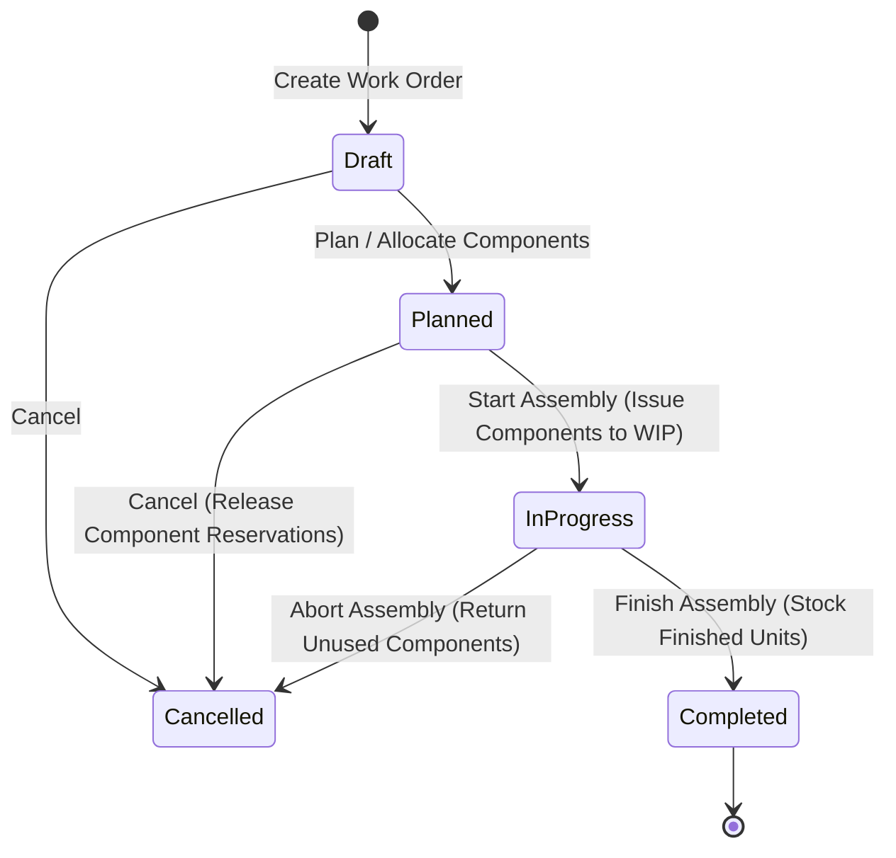

# Work Orders & Assemblies

The **Work Orders & Assemblies** module manages light assembly, kit building, and manufacturing. It decomposes multi-component Bills of Materials (BOM), allocates raw material parts, tracks work-in-progress (WIP), and calculates finished goods unit costs.

---

## Work Order Lifecycle & Costing



### 1. Work Order States & Progression
* **`Draft`**: Production job created, target assembly selected, and component requirements calculated from BOM.
* **`Planned`**: Components checked and reserved from warehouse storage bins. Shortages enter the Purchase Demands queue.
* **`In-Progress`**: Production underway. Component stock is physically issued from bins to Work-In-Progress (`wip` bin).
* **`Completed`**: Finished goods verified, unit cost calculated, finished items moved to Putaway staging, and work order closed.
* **`Cancelled`**: Job cancelled; reserved or issued components returned to storage.

### 2. Live Assembly Costing & Moving WAC
The unit cost of the finished assembly is calculated dynamically upon completion:

```
Assembly Cost Per Unit = (Sum of Component Quantities * Component Moving WAC) / Target Build Quantity
Total Work Order Cost = (Assembly Cost Per Unit * Target Build Quantity) + Additional Overhead / Labor Cost
```

Completing the work order capitalizes the finished product into inventory asset valuation at the new calculated WAC, while crediting the component inventory asset accounts.

---

## Step-by-Step Workflows

### 1. Creating and Executing a Work Order
1. Go to **Manufacturing** → **Work Orders** (`/work-orders`).
2. Click **New Work Order** (`/work-orders/new`).
3. Select the **Assembly Product** and enter the **Target Build Quantity**.
4. The system snapshots component requirements from the active Bill of Materials into `work_order_components`.
5. Click **Plan Work Order** to verify and reserve component stock.
6. When assembly begins, click **Start Assembly** to issue components.
7. Upon completion, enter verified finished units and any additional labor/overhead costs, then click **Complete Work Order**.

---

## Field Reference

| Field | Description |
| :--- | :--- |
| **Work Order Number** | Production identifier (`WO-...`). |
| **Assembly Product** | Finished item being manufactured. |
| **Target Build Quantity** | Planned assembly count. |
| **Components** | List of raw materials and sub-assemblies required. |
| **Status** | Stage (`Draft`, `Planned`, `In-Progress`, `Completed`, `Cancelled`). |
| **Assembly Unit Cost** | Total unit cost of the manufactured finished item. |
