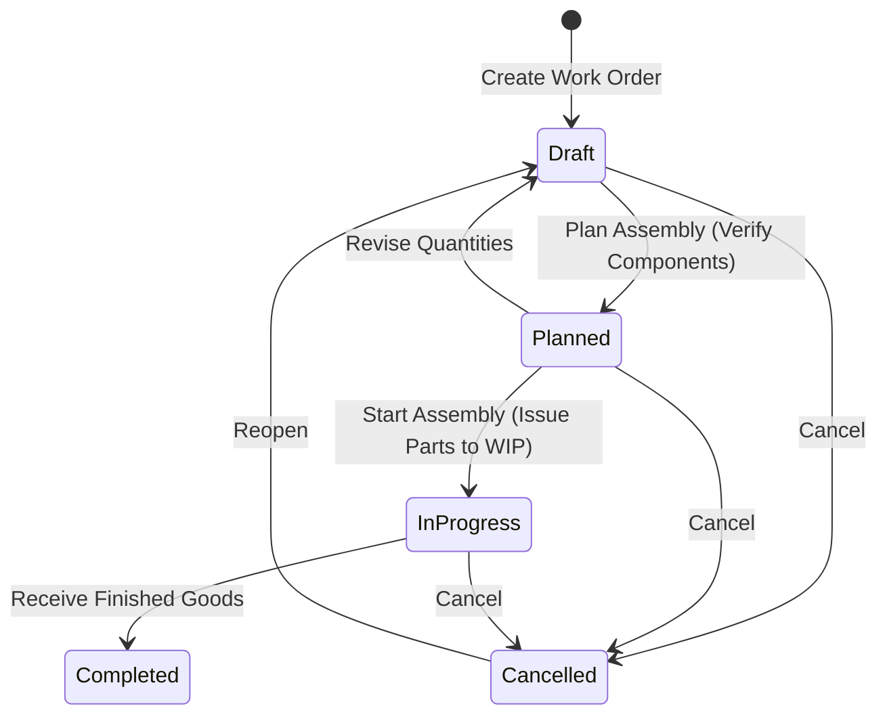

# Manufacturing & Work Orders

The **Work Orders** module coordinates assembly and manufacturing processes. It consumes raw component stock based on Bill of Materials (BOM) formulas, stages Work-in-Progress (WIP), rolls up assembly and additional costs, and receives capitalized finished goods into inventory.

---

## Manufacturing Lifecycle & Cost Rollup Logic



### 1. Bill of Materials (BOM) Component Requirements
When creating a work order, required component quantities are populated from the product's Bill of Materials:

```
Required Component Quantity = Target Quantity * BOM Component Ratio
```

* **Shortage Detection**: If any raw material component has insufficient stock, the system flags the shortage and logs a linked demand in the **Purchase Demands** queue tagged with the `demandWorkOrderId`.
* **Component Picking (`work_order_picks`)**: Moving to `Planned` and picking components transfers physical items from standard storage bins into the job's designated **`WIP Holding Bin`**.

### 2. Finished Good Valuation & Cost Rollup
When assembly is completed, the total manufacturing cost and finished good unit valuation are calculated:

```
Total Manufacturing Cost = Sum(Actual Component Qty Consumed * Component Unit Cost) + Additional Costs + (Assembly Cost Per Unit * Completed Qty)
Finished Good Unit Cost = Total Manufacturing Cost / Completed Quantity
```

The resulting unit cost becomes the capitalized Moving WAC baseline for the newly manufactured inventory batch.

### 3. General Ledger Manufacturing Postings

```
1. Component Consumption (Issue to Floor):
   Debit:  Work in Progress (WIP) Asset Account
   Credit: Raw Materials Inventory Asset Account

2. Finished Goods Completion:
   Debit:  Finished Goods Inventory Asset Account (Completed Qty * Finished Unit Cost)
   Credit: Work in Progress (WIP) Asset Account
   Credit: Direct Labor / Assembly Overhead Absorption Account (if applicable)
```

---

## Step-by-Step Workflows

### 1. Creating and Completing a Work Order
1. Go to **Manufacturing** → **Work Orders** (`/manufacturing/work-orders`).
2. Click **New Work Order**.
3. Select the **Finished Product**, destination **Warehouse Facility**, and specify the **Target Quantity**.
4. The system auto-populates the single-level Bill of Materials component lines and required quantities.
5. Click **Save as Draft**, then click **Plan Order** to verify component availability.
6. Pick the required component parts into the designated **WIP Bin**.
7. Click **Start Assembly** to advance to `In-Progress`.
8. When production is finished, enter the **Completed Quantity**, select the destination **Output Bin**, and review any additional assembly charges.
9. Click **Complete Work Order** to deposit finished units into storage and post capitalized asset entries.

---

## Field Reference

| Field | Description |
| :--- | :--- |
| **Work Order Number** | Unique production identifier (e.g. `WO-2026-00021`). |
| **Finished Good** | Assembled product SKU and title. |
| **Target Quantity** | Scheduled production count. |
| **Completed Quantity** | Actual verified units manufactured. |
| **Production Facility** | Warehouse location where assembly occurs. |
| **WIP Bin** | Staging bin holding raw materials during assembly. |
| **Output Bin** | Permanent storage bin receiving finished units. |
| **Assembly Cost Per Unit**| Direct labor/assembly rate per completed unit. |
| **Additional Cost** | Ad-hoc overhead or machine tooling charge. |
| **Total Cost** | Total capitalized manufacturing value. |
| **Status** | Stage (`Draft`, `Planned`, `In-Progress`, `Completed`, `Cancelled`). |
