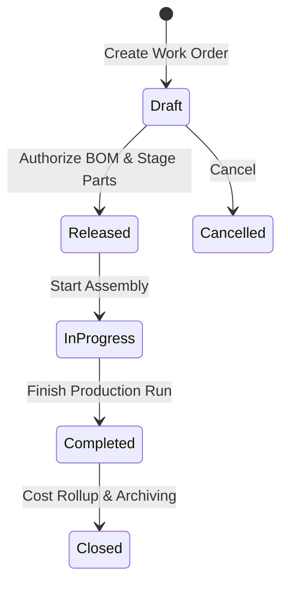

# Manufacturing & Work Orders

The **Work Orders** module manages light assembly and manufacturing. It consumes raw component stock based on Bill of Materials (BOM) formulas and produces finished goods ready for sale.

---

## Production Lifecycle & Rules

### 1. Component Consumption & Finished Goods Receipt
- **Issuing Components**: Moving a Work Order to `In-Progress` commits and consumes child components from warehouse bins.
- **Receiving Finished Goods**: Marking the Work Order as `Completed` increases on-hand inventory for the finished item and calculates final unit production costs.

---

## Step-by-Step Workflows

### 1. Creating and Completing a Work Order
1. Go to **Manufacturing** → **Work Orders** (`/work-orders`).
2. Click **+ New Work Order**.
3. Select the **Finished Product** to manufacture and enter the **Quantity to Produce**.
4. The system loads the default **Bill of Materials (BOM)** component list.
5. Click **Release Order** to reserve raw materials in the warehouse.
6. When assembly begins, click **Start Assembly**.
7. When production completes, enter the **Actual completedQuantity**.
8. Click **Complete Work Order** to restock the finished goods into storage bins.

---

## Field Reference

| Field | Description |
| :--- | :--- |
| **Work Order Number** | Unique production identifier. |
| **Finished Good** | Assembled product SKU. |
| **Target Quantity** | Scheduled production count. |
| **completedQuantity** | Actual good units manufactured. |
| **Status** | Stage (`Draft`, `Released`, `In-Progress`, `Completed`). |
